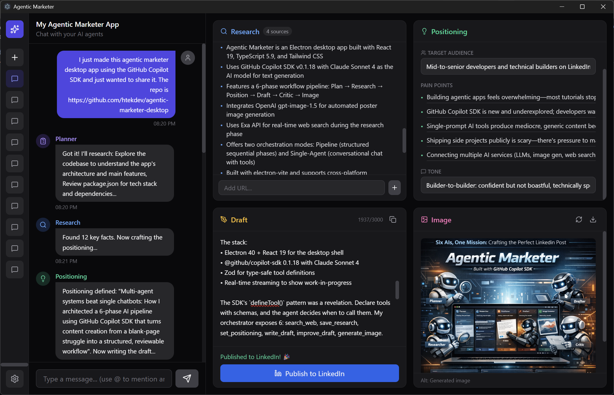

# Agentic Marketer Desktop

AI-powered LinkedIn post creator with intelligent agentic workflows. Built with Electron, React, and GitHub Copilot SDK.




## 📥 Download

**Get the latest release for your platform:**

| Platform | Download |
|----------|----------|
| **Windows** | [Agentic.Marketer.Setup.exe](https://github.com/htekdev/agentic-marketer-desktop/releases/latest) |
| **macOS (Apple Silicon)** | [Agentic.Marketer-arm64.dmg](https://github.com/htekdev/agentic-marketer-desktop/releases/latest) |
| **macOS (Intel)** | [Agentic.Marketer.dmg](https://github.com/htekdev/agentic-marketer-desktop/releases/latest) |
| **Linux** | [Agentic.Marketer.AppImage](https://github.com/htekdev/agentic-marketer-desktop/releases/latest) |

👉 **[View All Releases](https://github.com/htekdev/agentic-marketer-desktop/releases)**

### Quick Start

1. **Download** the installer for your platform above
2. **Install** and launch the app
3. **Configure API keys** in Settings (⚙️ gear icon):
   - OpenAI API Key (for image generation)
   - Exa API Key (for web research)
4. **Start creating** - type what you want to post about!

> **Requires:** [GitHub Copilot subscription](https://github.com/features/copilot) - The app uses GitHub Copilot SDK for AI text generation.

---

## Overview

Agentic Marketer is a desktop application that helps you create high-quality LinkedIn posts using AI. Simply describe what you want to post about, and the app will:

1. **Research** the topic using web search
2. **Position** the content for your target audience
3. **Draft** a compelling LinkedIn post
4. **Critique** and improve the draft automatically
5. **Generate** a complementary poster image
6. **Publish** directly to LinkedIn

## Features

### 🔬 Intelligent Research
- Web search via Exa API for current information
- Saves key facts and sources for reference
- Skips research for simple edits/follow-ups

### 🎯 Strategic Positioning
- Defines target audience and their pain points
- Sets tone (professional, casual, bold, etc.)
- Establishes unique angle for the content

### ✍️ AI Draft Writing
- Creates scroll-stopping hooks
- Proper LinkedIn formatting (short paragraphs, emojis, hashtags)
- 1300-2000 character sweet spot
- Never fabricates facts or experiences

### 🔄 Self-Critique
- Automatically improves drafts
- Enhances clarity, engagement, and conciseness
- Preserves your voice while polishing

### 🖼️ Image Generation
- Creates poster visuals via OpenAI gpt-image-1.5
- Complements the post content
- Professional, attention-grabbing designs

### 📤 LinkedIn Publishing
- Full OAuth 2.0 integration
- Publish text + image directly
- View published post link

## Orchestration Modes

Toggle between AI workflow patterns in Settings (gear icon):

| Mode | Description | Best For |
|------|-------------|----------|
| **Pipeline** | Sequential phases: Plan → Research → Position → Draft → Critic → Image | Structured, predictable workflow |
| **Single-Agent** | One conversational agent with all tools | Natural chat, flexible edits |

**Pipeline Mode** runs each phase with a specialized prompt. Great when you want consistent results.

**Single-Agent Mode** is a true chat experience - ask for changes naturally and the agent decides what tools to use.

## Tech Stack

| Layer | Technology |
|-------|------------|
| Desktop | Electron 40 |
| Frontend | React 19, TypeScript, Tailwind CSS |
| AI Text | GitHub Copilot SDK (Claude Sonnet 4) |
| AI Images | OpenAI gpt-image-1.5 |
| Web Search | Exa API |
| Storage | Local JSON files |

## Getting Started

### Prerequisites

- **Node.js 20+** - [Download](https://nodejs.org/)
- **GitHub Copilot subscription** - Required for Copilot SDK access
- **OpenAI API key** - For image generation
- **Exa API key** - For web research (optional but recommended)

### Installation

```bash
# Clone the repository
git clone https://github.com/your-username/agentic-marketer-desktop.git
cd agentic-marketer-desktop

# Install dependencies
npm install
```

### Environment Variables

Create a `.env` file in the project root:

```env
# Required - OpenAI API key for image generation
OPENAI_API_KEY=sk-...

# Required - Exa API key for web research
EXA_API_KEY=...

# Optional - LinkedIn OAuth credentials for direct publishing
# Get these from LinkedIn Developer Portal: https://developer.linkedin.com/
LINKEDIN_CLIENT_ID=...
LINKEDIN_CLIENT_SECRET=...
```

| Variable | Required | Description |
|----------|----------|-------------|
| `OPENAI_API_KEY` | Yes | OpenAI API key for gpt-image-1.5 image generation |
| `EXA_API_KEY` | Yes | Exa API key for web search during research phase |
| `LINKEDIN_CLIENT_ID` | No | LinkedIn app client ID for publishing |
| `LINKEDIN_CLIENT_SECRET` | No | LinkedIn app client secret for publishing |

> **Note:** Without LinkedIn credentials, you can still create posts and copy them manually. The "Publish to LinkedIn" button will be disabled.

### Development

```bash
npm run dev
```

This starts Electron in development mode with hot reload.

### Build

```bash
npm run build
```

Compiles TypeScript and bundles the application.

### Package for Distribution

```bash
npm run package
```

Creates distributable packages for your platform.

### Type Check

```bash
npm run typecheck
```

## Project Structure

```
agentic-marketer-desktop/
├── src/
│   ├── main/                    # Electron main process
│   │   ├── index.ts             # Entry point
│   │   ├── ipc/
│   │   │   └── handlers.ts      # IPC message handlers
│   │   ├── orchestration/       # AI workflow orchestrators
│   │   │   ├── interface.ts     # IWorkflowOrchestrator interface
│   │   │   ├── index.ts         # Factory + mode management
│   │   │   ├── pipeline/        # Sequential phase orchestrator
│   │   │   │   ├── orchestrator.ts
│   │   │   │   └── phases/      # 6 phase handlers
│   │   │   │       ├── planner-phase.ts
│   │   │   │       ├── research-phase.ts
│   │   │   │       ├── positioning-phase.ts
│   │   │   │       ├── draft-phase.ts
│   │   │   │       ├── critic-phase.ts
│   │   │   │       └── image-phase.ts
│   │   │   └── single-agent/    # Conversational orchestrator
│   │   │       └── orchestrator.ts
│   │   ├── services/
│   │   │   └── linkedin.ts      # LinkedIn OAuth + publishing
│   │   └── storage/
│   │       └── runs.ts          # Run persistence
│   ├── renderer/                # Electron renderer (React)
│   │   ├── App.tsx              # Main layout
│   │   ├── hooks/
│   │   │   └── useRun.tsx       # State management
│   │   └── components/
│   │       ├── Sidebar.tsx      # Navigation + history
│   │       ├── SettingsModal.tsx
│   │       ├── WorkflowInputModal.tsx
│   │       ├── WelcomeScreen.tsx
│   │       ├── chat/            # Chat UI
│   │       │   ├── ChatPanel.tsx
│   │       │   ├── MessageList.tsx
│   │       │   └── MessageInput.tsx
│   │       └── panels/          # Domain panels
│   │           ├── PanelGrid.tsx
│   │           ├── ResearchPanel.tsx
│   │           ├── PositioningPanel.tsx
│   │           ├── DraftPanel.tsx
│   │           └── ImagePanel.tsx
│   ├── shared/                  # Shared types
│   │   ├── types.ts             # Core types
│   │   ├── workflow-types.ts    # Workflow state types
│   │   └── channels.ts          # IPC channel definitions
│   └── preload/
│       └── index.ts             # Preload script
├── spec/                        # Project documentation
│   ├── DONE.md                  # Completed features
│   └── TODO.md                  # Remaining work
├── resources/                   # App icons, assets
├── .env                         # Environment variables (gitignored)
├── .env.example                 # Environment template
└── package.json
```

## Usage

### Creating a Post

1. **Start a new chat** - Click "New Chat" in the sidebar or start typing
2. **Describe your post** - e.g., "Write a post about the new React 19 features"
3. **Answer questions** (if any) - The planner may ask 1-3 clarifying questions
4. **Watch the panels update** - Research, positioning, draft, and image panels fill in
5. **Edit if needed** - Ask for changes: "Make it shorter" or "Add more stats"
6. **Publish or copy** - Click "Publish to LinkedIn" or copy the text

### Follow-up Edits

After a post is created, you can request changes:
- "Make the hook more attention-grabbing"
- "Add a statistic about developer productivity"
- "Change the tone to be more casual"
- "Generate a different image"

The AI will only re-run necessary phases.

### LinkedIn Setup

To enable direct publishing:

1. Go to [LinkedIn Developer Portal](https://developer.linkedin.com/)
2. Create an app and add the "Share on LinkedIn" product
3. Set redirect URL to `http://localhost:8377/callback`
4. Copy Client ID and Client Secret to your `.env` file
5. Restart the app
6. Click Settings → Connect LinkedIn

## Configuration

### Settings (Gear Icon)

- **Orchestration Mode** - Switch between Pipeline and Single-Agent
- **LinkedIn** - Connect/disconnect your LinkedIn account

### Keyboard Shortcuts

| Action | Shortcut |
|--------|----------|
| New Chat | Click sidebar button |
| Send Message | Enter |
| Settings | Click gear icon |

## Data Storage

All data is stored locally:
- **Runs**: `{userData}/agentic-marketer/runs/`
- **Settings**: `{userData}/agentic-marketer/settings.json`
- **Images**: `{userData}/agentic-marketer/images/`

On Windows, `{userData}` is typically `C:\Users\{username}\AppData\Roaming\`.

## Troubleshooting

### "Copilot SDK not authenticated"
Ensure you have an active GitHub Copilot subscription and are signed into GitHub.

### Image generation fails
Check that your `OPENAI_API_KEY` is valid and has credits. Complex prompts may be rejected.

### Research returns no results
Verify your `EXA_API_KEY` is set correctly. Some niche topics may have limited results.

### LinkedIn publish fails
Your OAuth token may have expired. Go to Settings → Disconnect → Reconnect.

## Documentation

- [Completed Features](spec/DONE.md) - What's implemented
- [Remaining Work](spec/TODO.md) - Future roadmap

## License

ISC
